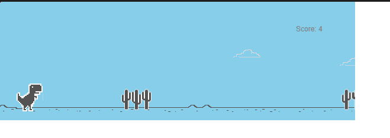

# Chrome Dino Runner Game

## Project Overview

This project is a recreation of the popular Chrome Dino Runner Game developed using JavaScript and the p5.js library. The player controls a dinosaur that must jump over obstacles and survive as long as possible while the game speed gradually increases.

## Game Preview

Add a screenshot of your game here.
## Game Preview



## Features

- Endless runner gameplay
- Jumping dinosaur character
- Multiple obstacle types
- Score tracking
- Game over screen
- Restart functionality
- Moving clouds and background effects
- Responsive game mechanics

## Technologies Used

- HTML5
- CSS3
- JavaScript
- p5.js Library

## Project Structure

```
├── index.html
├── style.css
├── sketch.js
├── p5.js
├── p5.play.js
├── p5.sound.min.js
├── cloud.png
├── obstacle1.png
├── obstacle2.png
├── obstacle3.png
├── obstacle4.png
├── obstacle5.png
├── obstacle6.png
├── trex1.png
├── trex3.png
├── trex4.png
├── trex_collided.png
├── gameOver.png
├── restart.png
└── README.md
```

## How to Run

1. Download or clone this repository.
2. Open the project folder.
3. Open `index.html` in your web browser.
4. Start playing the game.

## Controls

| Key | Action |
|------|---------|
| Spacebar | Jump |
| Up Arrow | Jump |
| Restart Button | Restart Game |

## Gameplay

- The dinosaur runs continuously.
- Avoid obstacles by jumping.
- The score increases over time.
- The game ends when the dinosaur collides with an obstacle.
- Press the restart button to play again.

## Learning Outcomes

Through this project, I learned:

- JavaScript game development
- Animation using p5.js
- Collision detection
- Sprite management
- Event handling
- Game state management

## Author

**Bhavya Mehta**

GitHub: https://github.com/bhayvammehta

## License

This project is created for educational and learning purposes.
